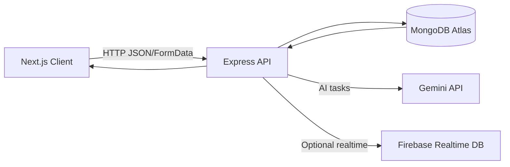

<div align="center">


# 🎯 SkillMatch AI Server

### The backend engine for SkillMatch — jobs, profiles, applications, interviews, AI workflows & notifications.

<p>
  
  
  
  
  
  
  
</p>

<p>
  <a href="#-project-overview">Overview</a> •
  <a href="#-system-architecture">Architecture</a> •
  <a href="#-api-documentation">API</a> •
  <a href="#installation--setup">Setup</a> •
  <a href="#-deployment">Deploy</a>
</p>

</div>

---

## 🚀 Project Overview

**SkillMatch AI Server** is the backend service that powers the SkillMatch web application. It provides a single API layer for:
- job posting and browsing
- candidate profiles and resume processing
- applications + recruiter hiring pipeline
- interview scheduling (Jitsi)
- tasks + submissions
- AI features (Gemini) such as communication tests, skill gap suggestions, and guided assistance
- notifications (stored in MongoDB + optional Firebase Realtime push)

### 🎯 Purpose of the backend
- Centralize business logic (jobs, applicants, interviews, tasks)
- Provide a consistent API contract for the Next.js frontend
- Securely handle secrets (Gemini API key, DB access)

### ✅ Key goals
- Beginner-friendly API responses (`success`, `message`, `data`)
- Clear feature modules (routes/controllers/services)
- Serverless‑friendly MongoDB caching (Vercel compatible)

---

## 🧠 System Architecture

### 🧩 How the backend works (simple)
1. **Client (Next.js)** sends API requests (JSON or multipart/form-data).
2. **Express server** routes requests to the correct module.
3. Data is read/written in **MongoDB**.
4. For AI features, the server calls **Gemini** (server-side only).
5. Notifications may be stored in MongoDB and optionally pushed to Firebase Realtime DB.

### 🔁 Client → Server → DB → AI flow



### 🧱 Entry points
- Local server entry: `index.js`
- Serverless entry (Vercel): `api/index.js` + `vercel.json`

---

## ✨ Core Features

### 🔐 Authentication (JWT)
This backend uses **Firebase Authentication** on the frontend and **Firebase Admin** on the backend.
- Clients send a Firebase **ID Token** (JWT) in the `Authorization` header.
- Middleware verifies the token and attaches `req.user` (uid, email, role).

### 💼 Job posting & management
- Create jobs (starts as `pending`)
- Admin endpoints to approve/reject/delete
- Save/unsave jobs
- Apply to jobs (creates application + timeline)

### 👤 Candidate profile handling
- Sync user after login (`/api/auth/sync-user`)
- Get/update profile (`/api/auth/profile/:uid`)
- Profile completion calculation

### 🤖 AI-based features (Gemini)
- Communication test sessions (question generation + evaluation)
- Skill gap analysis (match score + missing skills + learning suggestions)
- Read‑only support chatbot (Gemini + internal knowledge base)

### 🔎 Search & filtering (current + extendable)
Job listing and recruiter views are designed to be filterable; modules are separated so filters can be added safely.

---

## 🛠️ Tech Stack

| Category | Technology |
|---|---|
| Runtime | Node.js 20.x |
| Framework | Express.js |
| Database | MongoDB (Atlas) |
| Auth | Firebase Admin (verify Firebase ID tokens) |
| AI | `@google/generative-ai` (Gemini) |
| File upload | `multer` (memory storage) |
| Resume parsing | `pdf-parse`, `mammoth` |
| Deploy | Vercel (serverless) |

---

## 📡 API Documentation

### 🌐 Base URLs
- Local: `http://localhost:5000`
- Health: `GET /health`

### ✅ Response shape (typical)
Most endpoints follow:
```json
{ "success": true, "message": "...", "data": {} }
```


### 🧾 Sample Requests & Responses

#### 1) Sync a user after Firebase login
**POST** `/api/auth/sync-user`
```json
{
  "uid": "firebase_uid_123",
  "email": "user@example.com",
  "displayName": "Alex Candidate",
  "provider": "password",
  "photoURL": "",
  "role": "candidate"
}
```

**Response**
```json
{
  "success": true,
  "message": "User synced successfully",
  "upsertedId": null
}
```

---

#### 2) Apply to a job
**POST** `/api/jobs/<jobId>/apply`
```json
{
  "uid": "firebase_uid_123",
  "email": "user@example.com",
  "jobTitle": "Frontend Developer",
  "company": "Acme Inc",
  "location": "Remote"
}
```

**Response**
```json
{
  "success": true,
  "message": "Application submitted",
  "id": "664f0a0b1d2c3e4f5a6b7c8d"
}
```

---

#### 3) Ask the chatbot (requires token)
**POST** `/api/chatbot/ask`

Headers:
```http
Authorization: Bearer <firebase_id_token>
Content-Type: application/json
```

Body:
```json
{ "prompt": "Where can I see my saved jobs?" }
```

**Response**
```json
{
  "success": true,
  "assistant": "You can view saved jobs from your dashboard under Saved Jobs. Open the Saved Jobs page to see your saved list and remove any you no longer want."
}
```

---

## 🔐 Authentication & Security

### 🔑 Token handling
- Clients authenticate with Firebase and send the **Firebase ID Token** to the backend.
- Protected routes verify the token using Firebase Admin and attach:
```js
req.user = { uid, email, role }
```

### 🛡️ Security rules followed
- **Gemini is never called from the frontend** (server-only).
- User context for AI features is built server-side from MongoDB.
- Inputs are validated in multiple routes (IDs, required fields, basic sanitization).

### ⚠️ Recommended improvements (roadmap-ready)
To make the server more production‑secure, consider:
- Add token verification to more routes (jobs/applications/tasks) instead of trusting a `uid` in body/params.
- Add rate limiting (especially for AI endpoints).
- Add schema validation per route.

---

<a id="installation--setup"></a>
## ⚙️ Installation & Setup

### ✅ Prerequisites
- Node.js **20.x**
- MongoDB URI (Atlas recommended)
- Firebase Admin configured in backend services
- (Optional) Gemini API key for AI features

### 1) Install dependencies
```bash
cd SkillMatch-AI-Server
npm ci
```

### 2) Configure environment variables
Create `.env` from the example:
```bash
cp .env.example .env
```

**.env example**
```env
MONGODB_URI=
MONGO_DB_NAME=
GEMINI_API_KEY=
# Optional (protected routes + realtime notifications)
FIREBASE_SERVICE_ACCOUNT_JSON=
FIREBASE_PROJECT_ID=
FIREBASE_CLIENT_EMAIL=
FIREBASE_PRIVATE_KEY=
FIREBASE_DATABASE_URL=
CORS_ORIGIN=http://localhost:3000
PORT=5000
```

### 3) Start the server
```bash
npm start
```

Server runs on: `http://localhost:5000`

---

## ▶️ Usage Guide

### 🧭 Common workflow (happy path)
1. Frontend signs in with Firebase.
2. Frontend calls `POST /api/auth/sync-user` to upsert the user profile.
3. Candidate browses jobs: `GET /api/jobs`.
4. Candidate completes verification if required:
   - Skill test: `/api/skill-test/*`
   - Communication verification: `/api/verification/communication/*`
5. Before applying, frontend may call `POST /api/jobs/:jobId/pre-apply-check`.
6. Candidate applies: `POST /api/jobs/:jobId/apply`.
7. Recruiter reviews applications and updates status.
8. Recruiter schedules an interview (Jitsi): `POST /api/interviews/schedule` (protected).

---

## 📂 Project Structure

```text
SkillMatch-AI-Server/
├─ api/                      # Vercel serverless entry
│  └─ index.js
├─ config/                   # env + DB utilities
│  ├─ db.js
│  ├─ env.js
│  └─ systemKnowledge.json   # Chatbot knowledge base
├─ controllers/              # Route handlers (business logic)
├─ middleware/               # Auth + role gates
├─ models/                   # Collection/schema references
├─ routes/                   # Express routers (feature modules)
├─ services/                 # Gemini, Firebase, parsing, helpers
├─ .env.example
├─ index.js                  # Local dev entry
├─ vercel.json               # Vercel routing config
└─ package.json
```

---

## 🧪 Testing

### Option A) Postman / Insomnia
- Start with `GET /health`
- Then test a feature module (jobs, profiles, skill test)

### Option B) cURL quick tests
```bash
curl http://localhost:5000/health
```

```bash
curl -X POST http://localhost:5000/api/auth/sync-user \
  -H "Content-Type: application/json" \
  -d "{\"uid\":\"test_uid\",\"email\":\"test@example.com\"}"
```

---

## 🚀 Deployment

### ✅ Deploy to Vercel (recommended)
This backend is Vercel-ready:
- `vercel.json` routes all traffic to `api/index.js`.

Steps:
1. Create a Vercel project and import `SkillMatch-AI-Server/`.
   - If Vercel shows `No Output Directory named "public" found`, clear the Project Settings **Output Directory** (leave it blank). This repo also includes an empty `public/` folder for compatibility.
2. Add environment variables from `.env.example`.
3. Deploy.

### 🌍 CORS
Set `CORS_ORIGIN` as a comma-separated list:
```text
https://your-frontend.vercel.app,http://localhost:3000
```

---

## ⚠️ Error Handling

### Common error responses

| Status | When it happens | Example response |
|---:|---|---|
| 400 | Invalid payload / missing fields | `{ "success": false, "message": "..." }` |
| 401 | Missing/invalid token (protected routes) | `{ "success": false, "message": "Unauthorized: Missing Token" }` |
| 403 | Role/ownership restriction | `{ "success": false, "message": "Access denied" }` |
| 404 | Route or resource not found | `{ "success": false, "message": "Route not found" }` |
| 500 | Server misconfig or unexpected error | `{ "success": false, "message": "Internal server error" }` |

---

## 🔮 Future Improvements

- Protect more routes with token verification (not only interviews/chatbot)
- Add rate limiting for AI endpoints
- Add structured request validation per route
- Add Swagger/OpenAPI generation for the API tables
- Add unit + integration tests (e.g., supertest)
- Improve recruiter ownership checks for task submissions

---

## 👨‍💻 Author & Credits

- **Author:** Your Name
- **Project:** SkillMatch AI Server
- **Credits:** Express, MongoDB, Firebase Admin, Gemini SDK, and open-source community


